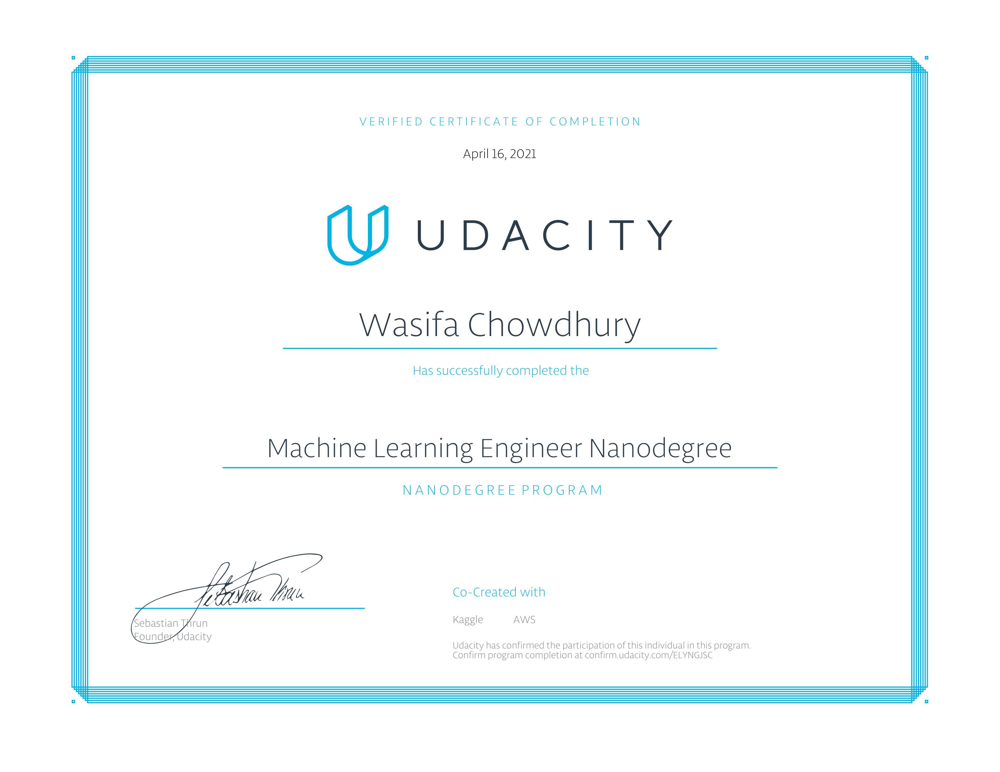

# About

Project work from the Udacity [Machine Learning Engineer](https://www.udacity.com/course/machine-learning-engineer-nanodegree--nd009t) Nanodegree 2020 encompassing advanced machine learning algorithms and how to package and deploy models to a production environment. 

  - Content of the coursework is co-created with [Kaggle](https://www.kaggle.com/) and includes real-world projects covering Machine Learning workflow from data processing and exploration, modeling to deployment.
  - Gain practical experience using Amazon SageMaker to deploy trained models to a web application and evaluate the performance of the models.
  - A/B test models and learn how to update the models as more data is gathered, an important skill in industry. 
  
  

# Projects

  - [Sentiment Analysis Web App](https://github.com/wchowdhu/udacity-git-ml-engineer-nanodegree/tree/master/projects/project_sentiment_analysis)
  - [Plagiarism Detection](https://github.com/wchowdhu/udacity-git-ml-engineer-nanodegree/tree/master/projects/project_plagiarism_detection)
  - [Capstone Project](https://github.com/wchowdhu/udacity-capstone-project)

# Coursework

  - [Software Engineering Fundamentals](https://github.com/wchowdhu/udacity-ml-engineer-nanodegree/tree/master/coursework/portfolio_exercise)
  - [Machine Learning in Production](https://github.com/wchowdhu/udacity-ml-engineer-nanodegree/tree/master/coursework/sentiment_analysis_xgboost)
  - [Machine Learning Case Studies](https://github.com/wchowdhu/udacity-ml-engineer-nanodegree/tree/master/coursework/ml_case_studies)
  - [Machine Learning Capstone](https://github.com/wchowdhu/udacity-capstone-project)

# Prerequisites

  - Python programming 
  - Knowledge of Machine Learning algorithms

